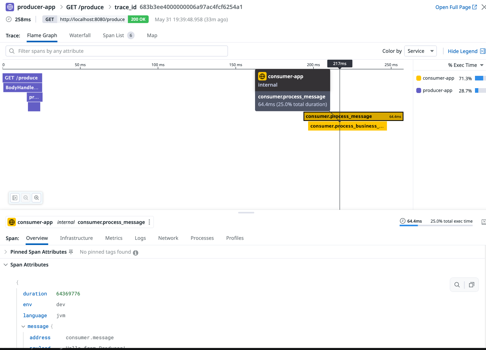
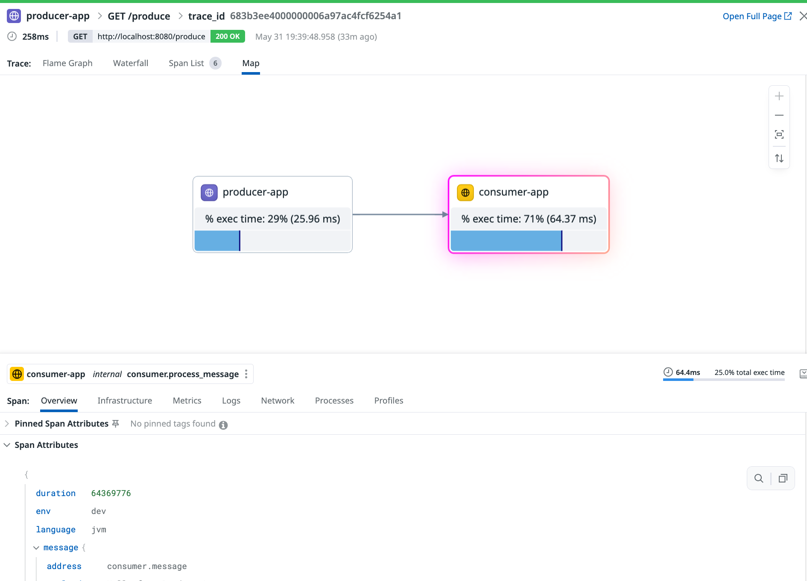

# Vert.x distributed tracing with Datadog

This project demonstrates distributed tracing across microservices using **Vert.x**, **Spring Boot**, **Hazelcast clustering**, and **DataDog** with **OpenTelemetry API** for trace context propagation.

## 🏗️ Architecture overview

```
[HTTP Request] → [Producer application] → [Event bus + Trace injection] → [Consumer application]
                       ↓                                                      ↓
                [Datadog Agent] ← ← ← ← ← ← ← ← ← ← ← ← ← ← ← ← ← ← [Datadog Agent]
                       ↓                                                      ↓
                            [Datadog backend - Unified trace view]
```

## 📋 Prerequisites

### Required software
- **Java 17+**
- **Docker & Docker compose**
- **Datadog agent** (running and accessible)
- **wget** (for downloading DataDog Java agent)

### Datadog setup
1. **Datadog account**: Having the corresponding API key
2. **Datadog agent**: Running on your system (listening on port 8126)
   ```bash
   # Example Datadog agent setup
   docker run -d --cgroupns host \
              --pid host \
              -v /var/run/docker.sock:/var/run/docker.sock:ro \
              -v /proc/:/host/proc/:ro \
              -v /sys/fs/cgroup/:/host/sys/fs/cgroup:ro \
              -p 127.0.0.1:8126:8126/tcp \
              -e DD_API_KEY=<DATADOG_API_KEY> \
              -e DD_APM_ENABLED=true \
              -e DD_SITE=<DATADOG_SITE> \
              gcr.io/datadoghq/agent:latest
   ```

## 📁 Project Structure

```
vertx-multi-spring-boot-clustered-otel/
├── dd-java-agent.jar                    # ← Datadog java agent (auto-downloaded)
├── docker-compose.yml                   # ← Container orchestration
├── producer-app/                        # ← HTTP API + Message producer
│   ├── src/main/java/com/datadoghq/pej/producer/
│   │   ├── ProducerApplication.java     # ← OpenTelemetry bean configuration
│   │   ├── ProducerVerticle.java        # ← Trace context injection
│   │   ├── GreetingVerticle.java
│   │   └── HttpServerVerticle.java
│   ├── build.gradle.kts                 # ← OpenTelemetry API dependency
│   └── Dockerfile                       # ← Datadog agent integration
└── consumer-app/                        # ← Message consumer
    ├── src/main/java/com/datadoghq/pej/consumer/
    │   ├── ConsumerApplication.java     # ← OpenTelemetry bean configuration
    │   └── ConsumerVerticle.java        # ← Trace context extraction
    ├── build.gradle.kts                 # ← OpenTelemetry API dependency
    └── Dockerfile                       # ← Datadog agent integration
```

## 🔍 Key Implementation Highlights

### 1. OpenTelemetry Bean Configuration
Both applications configure OpenTelemetry to use Datadog agent:

```java
@Bean
public OpenTelemetry openTelemetry() {
    // Datadog agent provides the implementation
    return GlobalOpenTelemetry.get();
}
```

### 2. Trace Context Injection (Producer)
Producer injects trace context into event bus messages:

```java
// Create message with business data
JsonObject messagePayload = new JsonObject()
    .put("messageType", "PRODUCER_MESSAGE")
    .put("payload", "Hello from Producer!");

// Inject current trace context into the message
openTelemetry.getPropagators()
    .getTextMapPropagator()
    .inject(Context.current(), messagePayload, SETTER);
```

### 3. Trace Context Extraction (Consumer)
Consumer extracts trace context and continues the distributed trace:

```java
// Extract trace context from incoming message
Context extractedContext = openTelemetry.getPropagators()
    .getTextMapPropagator()
    .extract(Context.current(), messageBody, GETTER);

// Create span with extracted context as parent
Span consumerSpan = tracer.spanBuilder("consumer.process_message")
    .setParent(extractedContext)
    .startSpan();
```

### 4. Datadog agent integration
Applications run with the Datadog java agent for automatic instrumentation and the custom instrumentation part is done using the OpenTelemetry API:

```docker-compose.yml
...
    environment:
      # Spring Boot profiles
      - SPRING_PROFILES_ACTIVE=docker
      # JVM settings for containerized environment
      - JAVA_OPTS=-XX:+UseContainerSupport -XX:MaxRAMPercentage=75.0
      # Hazelcast network configuration
      - HAZELCAST_NETWORK_JOIN_MULTICAST_ENABLED=false
      - HAZELCAST_NETWORK_JOIN_TCP_IP_ENABLED=true
      - HAZELCAST_NETWORK_JOIN_TCP_IP_MEMBERS=consumer-app,producer-app
      - JAVA_TOOL_OPTIONS=-javaagent:/app/dd-java-agent.jar -Ddd.agent.host=dd-agent-dogfood-jmx -Ddd.service=consumer-app -Ddd.env=dev -Ddd.version=12 -Ddd.trace.otel.enabled=true -Ddd.trace.sample.rate=1 -Ddd.logs.injection=true -Ddd.profiling.enabled=true -XX:FlightRecorderOptions=stackdepth=256 -Ddd.tags=env:dev
...
```

The `JAVA_TOOL_OPTIONS` env variable contains the necessary options to configure the Datadog java agent. 

### 5. Span Creation with Attributes
Custom spans include business context for better observability:

```java
Span span = tracer.spanBuilder("producer.send_message")
    .setAttribute("message.destination", "consumer.message")
    .setAttribute("message.type", "PRODUCER_MESSAGE")
    .startSpan();
```

## 🚀 How to Build

### 1. Download the Datadog agent (Automated)
```bash
# Make sure to export your API key before running the script. Run the setup script (handles agent download + build)

export DD_API_KEY=<your API key>
chmod +x docker-setup.sh
./docker-setup.sh
```

### 2. Manual build process
```bash
# Download the Datadog java agent
wget -O dd-java-agent.jar 'https://dtdg.co/latest-java-tracer'

# Build consumer application
cd consumer-app
./gradlew clean build
cd ..

# Build producer application  
cd producer-app
./gradlew clean build
cd ..

# Build and start Docker containers
docker-compose build
docker-compose up -d
```

## 🧪 How to test

### 1. Verify services are running
```bash
# Check container status
docker-compose ps

# Expected output:
[root@pt-instance-2:~/vertx/vertx-multi-spring-boot-clustered-otel]$ docker-compose ps
        Name                      Command                   State                                                  Ports                                          
------------------------------------------------------------------------------------------------------------------------------------------------------------------
dd-agent-dogfood-jmx   /bin/entrypoint.sh               Up (healthy)     0.0.0.0:8125->8125/tcp,:::8125->8125/tcp, 8125/udp,                                      
                                                                         0.0.0.0:8126->8126/tcp,:::8126->8126/tcp                                                 
vertx-consumer         sh -c java $JAVA_OPTS -jar ...   Up (healthy)   8081/tcp                                                                                 
vertx-producer         sh -c java $JAVA_OPTS -jar ...   Up (healthy)     0.0.0.0:8080->8080/tcp,:::8080->8080/tcp         
```

### 2. Test basic functionality
```bash
# Health check
curl http://localhost:8080/hello
# Expected: "Hello from Vert.x (Clustered)"

# Greeting service
curl http://localhost:8080/greet/Alice
# Expected: "Hi Alice, this is a Vert.x-powered greeting!"
```

### 3. Test Distributed Tracing
```bash
# Trigger producer-consumer communication with tracing
curl http://localhost:8080/produce
# Expected: "Triggered producer verticle: Message triggered successfully"
```

### 4. Verify Trace Propagation in Logs

**Producer logs should show:**
```
Triggering message from producer...
Injected trace context into message: {
  "messageType" : "PRODUCER_MESSAGE",
  "payload" : "Hello from Producer!",
  "timestamp" : 1748713257621,
  "x-datadog-trace-id" : "8353280935377654141",
  "x-datadog-parent-id" : "4454626395321405223",
  "x-datadog-sampling-priority" : "2",
  "x-datadog-tags" : "_dd.p.dm=-3,_dd.p.tid=683b3f2900000000",
  "traceparent" : "00-683b3f290000000073ecd0c0ce3a517d-3dd2031adc360f27-01",
  "tracestate" : "dd=s:2;p:3dd2031adc360f27;t.dm:-3;t.tid:683b3f2900000000"
}
Traced reply sent: Message triggered successfully
Producer received reply from consumer: {"messageType":"CONSUMER_REPLY","payload":"Message processed successfully by consumer at 1748713257678","originalMessageType":"PRODUCER_MESSAGE","processingTime":57,"x-datadog-trace-id":"8353280935377654141","x-datadog-parent-id":"7356796356717382617","x-datadog-sampling-priority":"2","x-datadog-tags":"_dd.p.dm=-3,_dd.p.tid=683b3f2900000000","traceparent":"00-683b3f290000000073ecd0c0ce3a517d-6618974ef7070bd9-01","tracestate":"dd=t.dm:-3;t.tid:683b3f2900000000"}
```

**Consumer logs should show:**

```
Consumer received message: {
  "messageType" : "PRODUCER_MESSAGE",
  "payload" : "Hello from Producer!",
  "timestamp" : 1748713257621,
  "x-datadog-trace-id" : "8353280935377654141",
  "x-datadog-parent-id" : "4454626395321405223",
  "x-datadog-sampling-priority" : "2",
  "x-datadog-tags" : "_dd.p.dm=-3,_dd.p.tid=683b3f2900000000",
  "traceparent" : "00-683b3f290000000073ecd0c0ce3a517d-3dd2031adc360f27-01",
  "tracestate" : "dd=s:2;p:3dd2031adc360f27;t.dm:-3;t.tid:683b3f2900000000"
}
Consumer processing payload: Hello from Producer!
Message processing completed for type: PRODUCER_MESSAGE
Consumer sent reply with trace context: {
  "messageType" : "CONSUMER_REPLY",
  "payload" : "Message processed successfully by consumer at 1748713257678",
  "originalMessageType" : "PRODUCER_MESSAGE",
  "processingTime" : 57,
  "x-datadog-trace-id" : "8353280935377654141",
  "x-datadog-parent-id" : "7356796356717382617",
  "x-datadog-sampling-priority" : "2",
  "x-datadog-tags" : "_dd.p.dm=-3,_dd.p.tid=683b3f2900000000",
  "traceparent" : "00-683b3f290000000073ecd0c0ce3a517d-6618974ef7070bd9-01",
  "tracestate" : "dd=t.dm:-3;t.tid:683b3f2900000000"
}
```

### 5. View Traces in Datadog

1. **Open the Datadog UI**: Navigate to APM → Traces in the UI
2. **Search for services**: Look for `producer-app` and `consumer-app`
3. **View Distributed trace**: Click on a trace to see the full request flow

<p align="left">
  
</p>


<p align="left">
  
</p>


**Expected Trace Structure:**
```
http.produce (Root Span - HTTP Request)
├── producer.handle_trigger (Producer handling)
├── producer.send_message (Event bus send)
└── consumer.process_message (Consumer processing)
    └── consumer.process_business_logic (Business logic)
```

**Expected Trace Attributes:**
- **Service Names**: `producer-service`, `consumer-service`
- **Operation Names**: `http.produce`, `producer.send_message`, `consumer.process_message`
- **Custom Attributes**: `message.type`, `message.destination`, `reply.success`
- **Trace ID**: Same across all spans (e.g., `4bf92f3577b34da6a3ce929d0e0e4736`)

## 🔧 Debugging

### Check Datadog Agent Connectivity
```bash
# Verify agent is receiving traces
curl http://localhost:8126/info
# Should return Datadog agent info

# Check agent logs
docker logs datadog-agent | grep -i trace
```

### View Application Logs
```bash
# Producer logs
docker-compose logs -f producer-app

# Consumer logs  
docker-compose logs -f consumer-app

# All logs
docker-compose logs -f
```

### Common Issues

1. **No Traces in Datadog**: Check agent connectivity and API key
2. **Broken Trace Continuity**: Verify trace context injection/extraction
3. **Missing Spans**: Check that spans are properly ended in `finally` blocks
4. **Wrong Service Names**: Verify `DD_SERVICE` environment variables

## 📊 Expected Datadog Metrics

Once running successfully, you should see:

- **Services**: `producer-service`, `consumer-service` in Datadog APM
- **Throughput**: Request rate metrics for `/produce` endpoint
- **Latency**: P50, P95, P99 latency distributions
- **Error Rate**: Success/failure rates for distributed operations
- **Service Map**: Visual representation of producer → consumer communication

## 🎯 Success Criteria

✅ **Containers Running**: Both services start without errors  
✅ **HTTP Endpoints**: All endpoints respond correctly  
✅ **Event Bus Communication**: Producer and consumer exchange messages  
✅ **Trace Propagation**: Same trace ID appears in both services  
✅ **Datadog Integration**: Traces visible in Datadog APM dashboard  
✅ **Distributed Spans**: Complete request flow from HTTP → Producer → Consumer

When all success criteria are met, you'll have a fully functional distributed tracing setup showing end-to-end request flows across your microservices architecture! 🎉